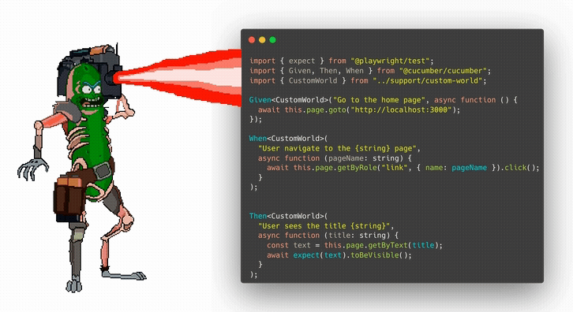

# Writing product-proof E2E tests with Cucumber & Playwright

> [!TIP]
> *Feel free to ⭐️ or bookmark this repository as a reference if you want to implement your own Cucumber/Playwright tests.*

This repository contains the source for a lightning talk I gave at Advanced JS meetup (JS Nation pre-event) in Amsterdam on June 11 2024.



## Instructions

### Setup
To run the project, clone this repository locally and run `yarn` to install dependencies.

To be able to run `playwright`, you might have to install the test browser. You can run the following command to set this up.

You will also need `node@18+` and `yarn` installed on your device.

 ```sh
 npx playwright install-deps chromium 
 ```
 
 ### Running the app
 To run the app, run the following command in your terminal. The app runs on `localhost:3000`.

 ```sh
yarn build
yarn start
 ```

### Running the test runner
To run `cucumber-js` together with `playwright`, run the following command. This runs headlessly in the background.

```sh
yarn test
```

If you want to see it happening live run the following command.

```sh
yarn test:record
```

This slows down the steps by adding some artificial delay and runs `chromium` in non-headless mode, so you can actually see it performing the steps. Additionally, it also creates a `.webm` video in the `videos` directory.
